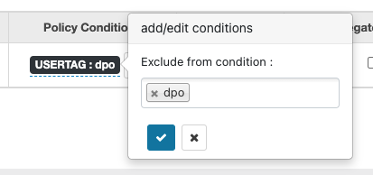

# Ranger Dynamic Policy Hook Example

The aim of this project is to show how to implement a custom Ranger Dynamic Policy Hook using an external RDBMS to enrich user's information.

## Quick Start

### 0. Prerequisites
This code is designed to run with the following configuration (should works with older versions, starting from Ranger 0.5.0):

* Apache Ranger 2.1.0
* Apache Hive 3.1.3000
* Apache Hadoop 3.1.1

To build the code you should have the following software installed:

* Git (Any version)
* Maven (3.6.3 or higher)
* Java (JDK 1.8)

The following tools are also needed to run the example:

* MariaDB (5.5 or higher)
* Curl (Any version)
* jq (Any version)
* tee (Any version)

### 1. Clone the repository
```git clone https://github.com/dvergari/RangerPolicyCustomTag.git```

### 2. Build source
```mvn clean package```

The jar ```RangerCustomPolicyTagDB-1.0-SNAPSHOT.jar``` will be created under the ```target/``` directory


## How to use it?

### 1. Add the generated jar to HS2 classpath
Copy the generated jar to HS2 classpath and restart the service. If you are using Cloudera Data Platform you can copy it to the ```ranger-hive-plugin-impl``` directory on HS2's home directory:

```scp target/RangerCustomPolicyTagDB-1.0-SNAPSHOT.jar root@<hs2-host>:/opt/cloudera/parcels/CDH/lib/hive/lib/ranger-hive-plugin-impl```

### 2. Install MariaDB and create the schema
On the target node, execute the following commands:

```yum install -y mariadb-server && systemctl start mariadb``` 

```mysql -u root < create_schema.sql```

### 3. Register ContextEnricher and ConditionEvaluator
We have to register the ContextEnricher and the ConditionEvaluator for the Hive service using the Ranger API. We have first to get the current service defintion with a GET request:

```curl -u admin:password123 -X GET https://$(hostname -f):6182/service/public/v2/api/servicedef/name/hive | jq . | tee hive_service.json```

Let's add the following entries:

```
"policyConditions": [
    {
      "itemId": 1,
      "name": "USERTAG",
      "evaluator": "com.dvergari.ranger.evaluator.RangerCustomTagEvaluator",
      "evaluatorOptions": {
        "attributeName": "USERTAG"
      },
      "label": "Exclude from condition",
      "description": "Exclude Tag"
    }
  ],
  "contextEnrichers": [
    {
      "itemId": 1,
      "name": "TagEnricher",
      "enricher": "com.dvergari.ranger.enricher.RangerCustomTagEnricher",
      "enricherOptions": {
        "dbUrl": "jdbc:mysql://localhost/repository",
        "username": "user",
        "password": "password",
        "table": "usertags"
      }
    }
  ],
```

In the contextEnrichers node we set the following properties for DB connection:

* dbUrl
* username
* password
* table

Now let's ```PUT``` this back to Ranger:

```curl -u admin:password123 -X PUT --data @hive_service.json -i -H 'Content-Type: application/json' https://$(hostname -f):6182/service/public/v2/api/servicedef/name/hive```

On the Hive Repository page we should now see the Policy Conditions fields



Now, all users tagged as "dpo" in the MariaDB database are excluded from the policy.